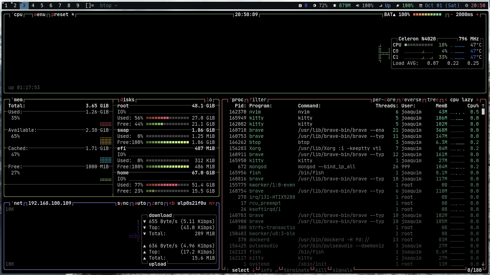

# dwm - dynamic window manager
A fork of [dwm](https://dwm.suckless.org/), an extremely fast, small, and dynamic window manager for X.

### Notes
I highly recomend you check out the config file to see the colors, icons, keybinds and other stuff.

I don't use the Xdefaults patch because I mean it's too trivial to use the [config.def.h](config.def.h) file.

The installation will create 4 binaries in your system:
- dwm_status_bar
- print_fullscreen
- print_select
- print_window
- dmenuunicode (and place a file at *~/.local/share/dwm_utils/emoji*)
- copygittoken

You can modify them if you have problems or you just want to, and then you must (re)compile it. They are avaliable inside the [scripts](scripts) folder.

Throughout the [config file](config.def.h) you can check the keybings and all dependencies.

### Requirements
In order to build dwm you need the Xlib header files.

A [Nerd Font](https://www.nerdfonts.com) (I'm using **Hack NF** btw) and a font for emojis (you don't need if you won't use emojis on the status bar) (I'm using **Noto Color Emoji**).

**scrot** to take screenshots.

**viewnior** to see the screenshot instantly (it will open automatically in the 8th tag).

**[st](https://github.com/jgsn13/st)** is the default terminal emulator.

**xclip** to copy to clipboard (it's used to copy emojis and the git token).

**dunst** to handle notifications.

**dmenu** to launch applications.

**amixer** to control the sound.

**xdotool** if you want emojis.

**slock** to lock the screen (Optional).

A file called **.gittoken** in your home directory with your git token without blank spaces.

***Don't use root user to install, use `sudo`, otherwise the makefile will create folders/files in the wrong place***

### Installation
To build and install dwm:
```
sudo make clean install
```

### Running dwm
Add the following line to your ***.xinitrc*** (or any other xorg server starter) to start dwm using ***startx/xinit (or sx if you use it)***:
```
exec dwm
```

In order to connect dwm to a specific display, make sure that
the DISPLAY environment variable is set correctly, e.g.:

    DISPLAY=foo.bar:1 exec dwm

(This will start dwm on display :1 of the host foo.bar.)

In order to display status info in the bar, you can do something
like this in your ***.xinitrc***:
```
while xsetroot -name "`date` `uptime | sed 's/.*,//'`"
do
    sleep 1
done &
exec dwm
```
**I highly recommend that you use the [script](scripts/dwm_status_bar) I made and run it in your .xinitrc before `exec dwm`.**
Example (my config):
*.config/sx/sxrc* or *.xinitrc*
```
xsetroot -cursor_name left_ptr &
${HOME}/.fehbg &
dwm_status_bar &
picom -f  
exec dwm
```

### Configuration
The configuration of dwm is done by editing ***config.def.h*** and (re)compiling the source code.

### Screenshots


