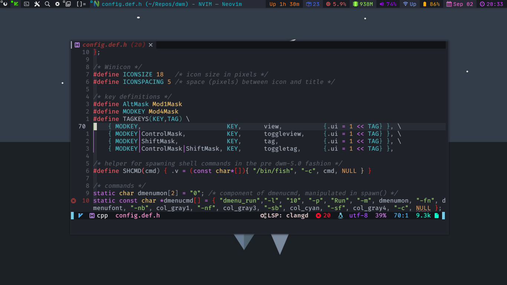

# dwm - dynamic window manager
A fork of [dwm](https://dwm.suckless.org/), an extremely fast, small, and dynamic window manager for X.


### Requirements
In order to build dwm you need the Xlib header files.

A [Nerd Font](https://www.nerdfonts.com) (I'm using **JetBrainsMono Nerd** btw) for the status bar.

**`scrot`** to take screenshots.

**viewnior** to see the screenshot instantly (it will open automatically in the 8th tag).

***Don't use root user to install, use `sudo`, otherwise the makefile will create folders/files in the wrong place***


### Installation
Edit config.mk to match your local setup (dwm is installed into
the /usr/local namespace by default).

Afterwards enter the following command to build and install dwm:
```
sudo make clean install
```


### Running dwm
Add the following line to your ***.xinitrc*** (or any other xorg server starter) to start dwm using ***startx/xinit (or sx if you use it)***:
```
exec dwm
```

In order to connect dwm to a specific display, make sure that
the DISPLAY environment variable is set correctly, e.g.:

    DISPLAY=foo.bar:1 exec dwm

(This will start dwm on display :1 of the host foo.bar.)

In order to display status info in the bar, you can do something
like this in your ***.xinitrc***:
```
while xsetroot -name "`date` `uptime | sed 's/.*,//'`"
do
    sleep 1
done &
exec dwm
```
**I highly recommend that you use the [script](scripts/dwm_status_bar.sh) I made and run it in your .xinitrc before `exec dwm`.**


### Configuration
The configuration of dwm is done by editing ***config.def.h***
and (re)compiling the source code.


### Screenshots


